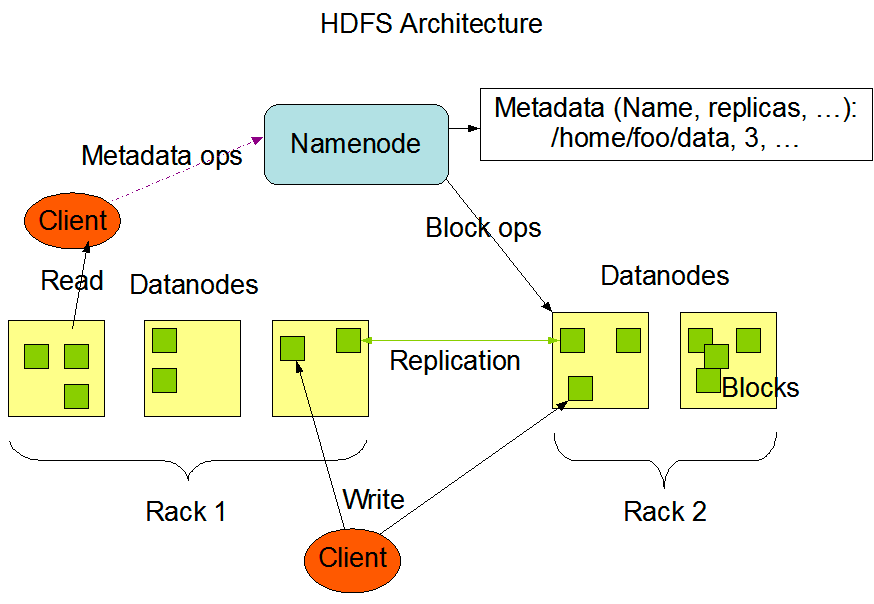
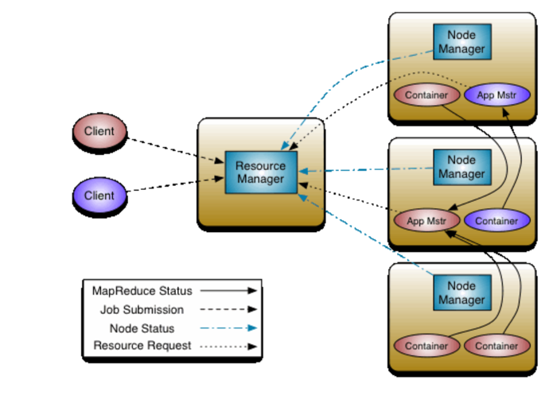

不懂就问

### Q: 什么是Hadoop？

A: Hadoop是一个包含：`存储`、`计算`、`资源管理` 的大数据处理平台。 分别对应了三大组件：HDFS、MapReduce、Yarn。

- HDSF：Hadoop Distributed File System。分布式文件系统，来源于GFS。
- MapReduce：一套分布式计算框架。来源于Google的paper。
- Yarn：Yet Another Resource Negotiator。另一种资源调度器。抽离于MapReduce中资源调度工作。

### Q: HDFS Architecture

HDFS是master/slave架构，由一个NameNode和多个DataNode构成。

- NameNode：作为master server，管理文件系统的metadata。
- DataNode：作为存储节点，提供给client的读写请求。

### Q: YARN Architecture

抽离了resource management和job scheduling/monitoring功能。 它包含一个global
ResourceManager、每个application都会有一个ApplicationMaster、每个机器都包含的NodeManager。

- ResourceManager：负责scheduler(资源分配)和ApplicationManager(管理提交的job)。
- ApplicationMaster：client提交job后，会创建一个AppMstr来与ResourceManager申请资源，并将app发到容器中启动。
- NodeManager：监控机器资源并向ResourceManager上报。

